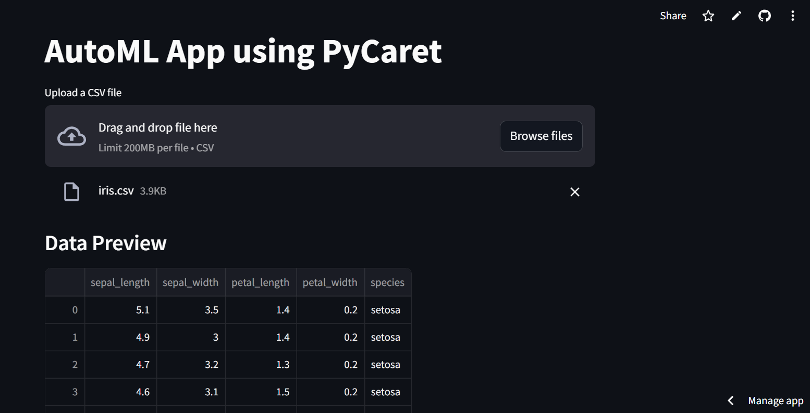
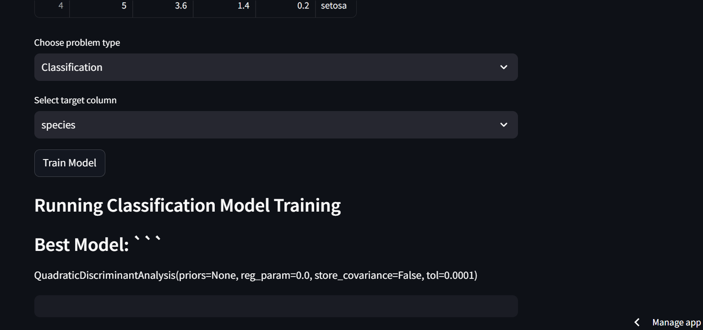
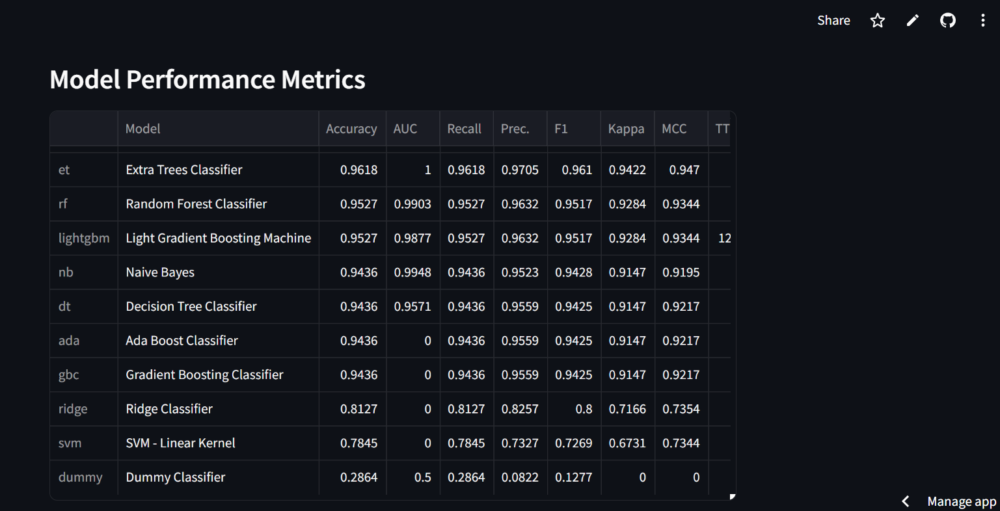

# 🚀 AutoML App using PyCaret

**Your one-stop solution for automated machine learning!** 

This interactive web application, built with Streamlit and powered by PyCaret, allows you to effortlessly upload your datasets and unleash the power of machine learning without any coding experience!

## 🌟 Features
- **Easy Data Upload**: Simply drag and drop your CSV files.
- **Choose Your Adventure**: Select between regression and classification tasks.
- **Automated Model Training**: Let PyCaret do the heavy lifting for you.
- **Performance Metrics**: Get instant feedback on model performance.
- **Download Predictions**: Export your results with a click of a button.

## 📦 Installation
To get started with this project, follow these simple steps:

1. **Clone the repository**:
   ```bash
   git clone https://github.com/kiran-91/AutomaticML.git
   cd AutomaticML
   ```
2. **Create a virtual Environment (Optional but recommended)**
   ```bash
   python -m venv venv
   source venv/bin/activate # on linux/mac
   venv\Scripts\activate    # on windows


3. **Install the required packages**:
   ```bash
   pip install -r requirements.txt
   ```

4. **Run the application**:
   ```bash
   streamlit run app.py
   ```

## 🛠️ Usage
> **⚠️ Note**: Please note that PyCaret requires significant computational resources, which may result in a delayed display of results.

1. Launch the application using the command above.
2. Upload your CSV file containing the dataset.
3. Select the problem type (Regression or Classification).
4. Choose the target column from your dataset.
5. Click on the "Train Model" button and watch the magic happen!
6. Review the model performance metrics and download your predictions.

## 📸 Screenshots




## 🤝 Contributing
We welcome contributions! If you have suggestions or improvements, feel free to open an issue or submit a pull request.

## 📄 License
This project is licensed under the MIT License - see the [LICENSE](LICENSE) file for details.

## 💬 Feedback
We'd love to hear your thoughts! Please provide feedback or suggestions to help us improve this application.
